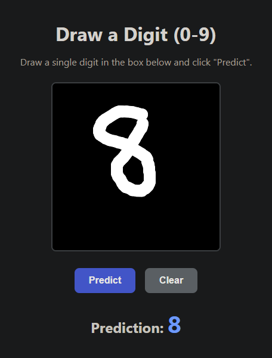

# MNIST Digit Recognizer API with PyTorch and Docker

This project demonstrates a complete end-to-end workflow for training a deep learning model, wrapping it in a web API, and setting up a fully automated CI/CD pipeline. The application trains a **MobileNetV2** model on the classic MNIST dataset and exposes it through a **Flask** API, containerized with **Docker** and automated with **Jenkins**.


---

## ✨ Features

-   **Model Training**: A Python script (`main.py`) to train a PyTorch MobileNetV2 model on the MNIST dataset, compatible with Apple Silicon (MPS).
-   **Web Interface**: A user-friendly frontend (`index.html`) where you can draw a digit and get a real-time prediction from the model.
-   **REST API**: A robust Flask backend (`app.py`) that serves the model through a `/predict` endpoint.
-   **Containerization**: A `Dockerfile` and `docker-compose.yml` to create a portable, reproducible, and production-ready environment.
-   **Automated CI/CD**: A `Jenkinsfile` that defines a complete pipeline to automatically build, test, and deploy the application upon code changes.

---

## 🚀 Tech Stack

-   **Backend**: Python, Flask
-   **Deep Learning**: PyTorch, Torchvision
-   **Containerization**: Docker, Docker Compose
-   **CI/CD**: Jenkins
-   **Frontend**: HTML, CSS, JavaScript

---

## 📂 Project Structure

```
.
├── static/
│   └── style.css         # Styles for the web interface
├── templates/
│   └── index.html        # Frontend HTML page
├── app.py                # Flask application with the API
├── main.py               # Script to train the model
├── test.py               # Script to test inference locally
├── Dockerfile            # Instructions to build the Docker image
├── docker-compose.yml    # Defines how to run the container
├── Jenkinsfile           # CI/CD pipeline script
├── mnist_mobilenet.pth   # (Generated after training)
└── requirements.txt      # Python dependencies
```

---

## 🏁 Getting Started

Follow these instructions to get the project up and running on your local machine using a Docker-centric workflow.

### Prerequisites

-   [Git](https://git-scm.com/)
-   [Docker Desktop](https://www.docker.com/products/docker-desktop/)

### Local Installation & Setup

**1. Clone the Repository**
```bash
git clone [https://github.com/as4401s/Mnist_docker_deployment.git](https://github.com/as4401s/Mnist_docker_deployment.git)
cd Mnist_docker_deployment
```

**2. Train the Model (Recommended: Inside Docker)**
To ensure a consistent environment, run the training script inside a temporary Docker container. This will generate the `mnist_mobilenet.pth` file in your local directory.

```bash
docker-compose run --rm web python main.py
```

**3. Build and Run the Application**
This single command builds the Docker image from the `Dockerfile` and starts the Flask web application.

```bash
docker-compose up --build
```

**4. Access the Application**
Once the container is running, open your web browser and navigate to:
[**http://localhost:5005**](http://localhost:5005)

You should see the web interface. Draw a digit and test the prediction! To stop the application, press `Ctrl + C` in your terminal and run `docker-compose down`.

---

## ✅ Testing

To run a quick inference test on a random image from the MNIST test set, use this command:
```bash
docker-compose run --rm web python test.py
```

---

## ⚙️ CI/CD Pipeline with Jenkins

This project includes a `Jenkinsfile` to create a fully automated deployment pipeline.

### How It Works

1.  **Trigger**: The pipeline is triggered automatically when you push a new commit to the `main` branch of your Git repository.
2.  **Checkout**: Jenkins checks out the latest version of your code.
3.  **Build**: It runs `docker-compose build` to create a fresh Docker image with the latest changes.
4.  **Test**: It runs the `test.py` script inside a container to perform a quick sanity check on the model.
5.  **Deploy**: It starts the new container in the background by running `docker-compose up -d`.
6.  **Cleanup**: After the pipeline finishes (whether it succeeds or fails), the `post` block runs `docker-compose down` to ensure the environment is left clean.

This setup ensures that any changes you push are automatically and safely deployed, creating a seamless and efficient workflow.
